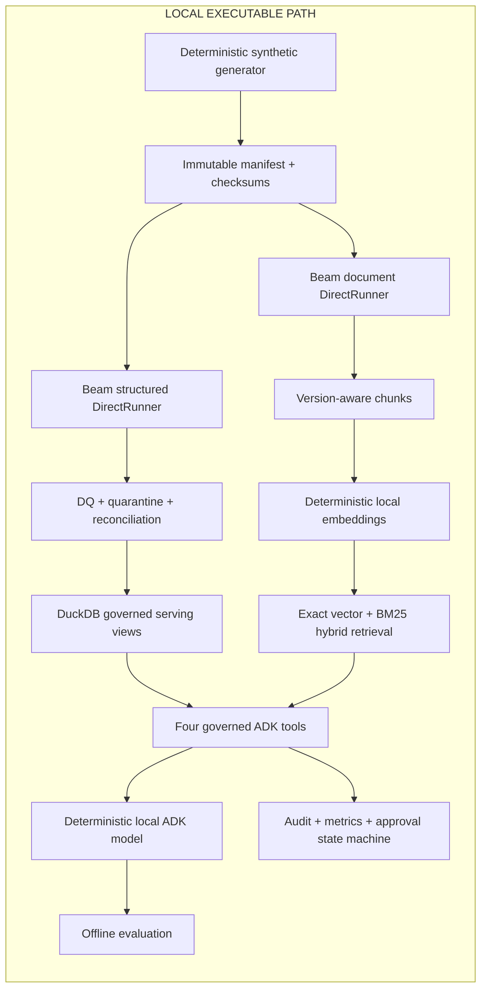

# AI-Ready Enterprise Data Platform

A production-realistic reference implementation showing how one governed enterprise data
foundation can support structured analytics and grounded agent applications. The fictional
business is an enterprise customer-operations team combining account, invoice, support, usage,
contract, SLA, policy, runbook, and incident data.

This is not a generic chatbot or a live cloud deployment. The executable path is deterministic,
synthetic, local, and cloud-free.

## Evidence boundary

| Category | Evidence in this repository |
|---|---|
| Implemented and locally tested | Immutable delivery, Beam DirectRunner graphs, DQ/quarantine/reconciliation, DuckDB serving, deterministic embeddings, exact vector/BM25 hybrid retrieval, external authorization, Google ADK routing, audit, approval workflow, metrics, offline evaluation, and the end-to-end demo |
| Implemented and statically validated for GCP | BigQuery table/view/search/index SQL and the explicitly injected Vertex embedding request contract |
| Production architecture target—not deployed | Cloud Storage, Dataflow, BigQuery, Vertex AI embeddings, BigQuery search indexes, and a separately governed ADK runtime |
| Not evidenced | GCP execution, production scale/QPS/latency/SLA/cost/users, cloud IAM enforcement, ANN recall, hosted-model answer quality, or production security certification |

The repository has no Terraform, deploy workflow, cloud-client construction path, credentials,
paid model call, or command that creates infrastructure. CI has read-only repository permission.

## Architecture



The production mapping and trust boundaries are in
[`docs/gcp-production-blueprint.md`](docs/gcp-production-blueprint.md). None of those cloud
services is deployed by this repository.

## Data and processing contracts

Each delivery is immutable:

```text
data/input/business_date=YYYY-MM-DD/batch_id=<batch-id>/
  structured/{accounts,invoices,support_cases,product_usage_daily}.csv
  documents/documents.jsonl
  manifest.json
  _SUCCESS
```

The manifest fixes exact relative paths, row counts, formats, SHA-256 checksums, schema version,
business date, batch ID, scenario, seed, and generated timestamp. Regeneration cannot overwrite an
existing identity. Structured rows use explicit contracts, deterministic latest-update/hash
deduplication, account-reference validation, row quarantine, reconciliation, and stable lineage.

Document identity separates document ID, version, content hash, chunk ID, and embedding version.
Only the latest effective version remains active. Paragraph-aware chunks preserve classification,
allowed groups, account scope, dates, source URI, owner, and content provenance.

Table/view grains and replay behavior are documented in [`docs/data-model.md`](docs/data-model.md).

## Governed analytics and knowledge access

DuckDB provides an executable local analytical path. The agent can query only the allowlisted
`serving_account_health` view through a parsed, single-statement, bounded read-only SQL policy.
DDL, DML, multi-statement SQL, unknown relations, and excessive limits fail closed.

Knowledge authorization occurs before scoring. Principal groups, region, classification, document
activity, and optional account scope are enforced outside the model. Returned evidence includes
document/version/chunk IDs, source URI, content hash, method, and score. Retrieved text is tagged as
untrusted data; embedded prompt text cannot change the bound principal.

The local retriever combines exact cosine and BM25-style lexical ranks. It is a deterministic test
reference, not a BigQuery performance substitute. Production-reference BigQuery SQL is isolated in
[`sql/bigquery`](sql/bigquery); it is linted but never executed.

## Google ADK agent

One Google ADK agent exposes exactly four tools:

1. `run_governed_sql`
2. `search_enterprise_knowledge`
3. `get_data_freshness`
4. `request_pipeline_reprocessing`

The default model is a minimal deterministic `BaseLlm` implementation. It uses no network, API key,
or hosted inference. The operation tool can only create `PENDING_APPROVAL`; a separate service must
approve it, and the only executor is a safe local state transition. No GCP executor exists.

## Evaluation and observability

The versioned offline dataset covers correct routing, structured results, authorized citations,
restricted refusal, freshness discrepancy, and approval boundaries. Deterministic metrics include
Recall@K, MRR, nDCG@K, empty-result rate, citation existence, authorization leakage, phrase-level
fact support, stale-warning disclosure, and operation state. These checks are not equivalent to a
human or hosted-LLM groundedness evaluation.

Structured local metrics cover input/accepted/quarantined rows, document/chunk/embedding counts,
retrieval requests/latency/empty results, SQL queries/blocked attempts, and denied candidates.
Audit events hash the actor and prohibit raw prompt, SQL, document, token, secret, or credential
fields.

See [`docs/evaluation.md`](docs/evaluation.md) and [`docs/runbook.md`](docs/runbook.md).

## Run locally

Python 3.11 is the tested CI runtime. Install the Linux CI dependency lock with hashes where
appropriate, or install the exact top-level project dependencies in an isolated local environment.

```text
python -m demo.run --scenario account-risk
python -m pytest -q
python -m ruff check .
python -m ruff format --check .
python scripts/check_repo_safety.py
```

The demo generates temporary synthetic data, executes both Beam graphs under DirectRunner, loads
DuckDB, builds local indexes, invokes the real ADK runner through all four tools, and prints
citations, freshness, audit, metrics, and approval status. It requires no network.

## Failure and recovery model

Important failures are explicit rather than silently dropped: missing/tampered manifests, schema
and count mismatch, duplicate keys, orphan references, malformed or stale document versions,
embedding failures/dimension mismatch, empty or restricted retrieval, stale sources, unsafe SQL,
index conflicts, tool failure, and invalid approval transitions. Detection, retry, replay, and
operator response are in [`docs/failure-scenarios.md`](docs/failure-scenarios.md).

## Cost and deployment safety

- No cloud authentication, project ID, billing ID, credential, or secret is required.
- No Terraform, Cloud Build, deploy job, manual workflow trigger, OIDC permission, or image push
  exists.
- GitHub Actions uses only `ubuntu-latest`, read-only contents permission, SHA-pinned actions, and a
  hash-locked dependency file.
- BigQuery index DDL is reference SQL only. Creating a real index would consume cloud compute; this
  repository never executes it.
- `scripts/check_repo_safety.py` fails if workflow or credential safeguards regress.

## Defensible portfolio boundary

The repository supports describing a locally tested, production-realistic AI-ready data-platform
reference implementation. It does **not** support claiming a live deployment, production workload,
measured cloud performance/cost/SLA, real enterprise data/users, or complete prompt-injection
prevention. Final portfolio wording remains subject to independent A1 review.
