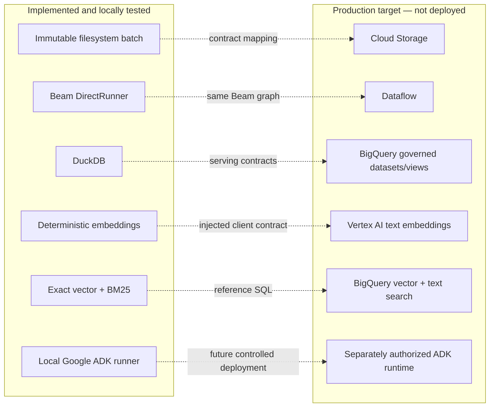

# GCP production blueprint — not deployed

Every service on the right side of this mapping is an architecture target and is **not deployed by
this repository**.

Production IAM should separate ingestion, transformation, serving-query, embedding, agent-tool, and
operator-approval identities. The agent should see only authorized views and retrieval procedures;
raw datasets, mutation permissions, index administration, and pipeline execution remain outside its
identity. Query budgets, timeouts, labels, data policy controls, audit export, key management,
regional constraints, and human approval would require environment-specific review.

BigQuery is the canonical production retrieval target because governed analytics and knowledge
metadata already reside there. A separately served vector system is deliberately excluded at this
portfolio scale; it would add duplicated governance and cost. It could be reconsidered only after
measured online QPS/latency requirements.

The SQL files show datasets, tables, authorized serving views, freshness/audit surfaces, text search,
vector index, semantic search, and hybrid search. They are statically linted. Index creation consumes
BigQuery compute, and neither that DDL nor any query is executed here.
